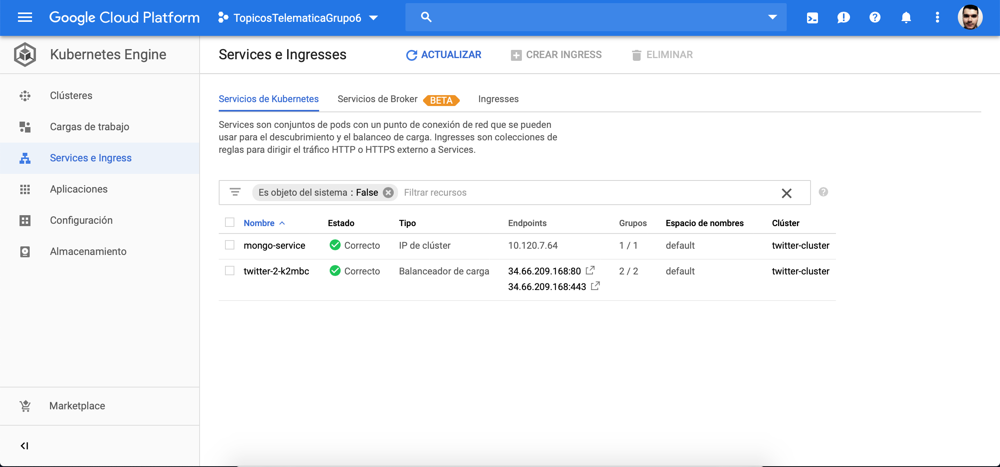

# Topicos de Telemática EAFIT - Grupo 6

## App Desplegada
IP del despliegue en Google Cloud (Kubernetes): http://34.66.209.168
DNS con la IP: http://topicosgrupo6.ml

# Integrantes:

- Andres Felipe Villada Montoya - avillada@eafit.edu.co
- Diego Andres Giraldo Gomez - dgiral58@eafit.edu.co
- Santiago Ortiz Cano - sortizc1@eafit.edu.co

# Roles:

- Andres:
Encargado directo de brindarle seguridad al proyecto, aplicando tecnicas que ayuden a la disminución, supresión o eliminación del riesgo posibles ataques o fallos tales que puedan comprometer tanto la integridad ya sea de la aplicación, los usuarios y principalmente los datos. Encargado de implementar y acoplar al modelo de negocio un mecanismo de registro e inicio de sesión con todas las garantías de seguridad requeridas además de un modelo de base de datos que soportára esta lógica.

- Diego:
Encargado de brindarle una completa disponibilidad al proyecto, manipulando la arquitectura y distribución de capas. Es el encargado de montar el proyecto sobre una infraestructura la cual sea lo menos sensible a fallos posible, ademas de tener la capacidad de poder recuperarse ante un eventual fallo o sobrecarga del sistema, ya sea creando múltiples instancias del servidor dinamicamente o con tecnologías de control de fallos.

- Santiago:
Encargado del performance de la aplicación, aplicando las mejores prácticas en desarrollo, arquitectura y planeación del proyecto intentando elevar al máximo tanto la confiabilidad, velocidad y capacidad del proyecto. Es ademas su tarea, la optimizaron de las funcionalidades del proyecto aplicando técnicas de operaciones asincrónicas e intentando reestructurar la arquitectura inicial para lograr un mínimo de operaciones complejas, redundantes y de acceso a las otras capas.
 
 # Requisitos:
 
- Seguridad:
La información debe estar totalmente segura tanto la entregada por la capa de visualización como la almacenada en la base de datos; La aplicación debe poder ser lo suficientemente modular para que de ser comprometida una de las capas, no transmita este fallo a las demás; La aplicación debe poder ser resistente a ataques a servicios web (SQL Injection, Man in the midle, Cross origin, etc.); Cualquier fallo tanto provocado como interno en la aplicación, no debe comprometer la información de ningún tipo.

- Disponibilidad:
La aplicación debe ser resistente a cualquier eventual fallo, debe poder ser capaz de auto gestionar su disponibilidad y carga. La aplicación debe poder recuperarse en caso de ser afectada por algún fallo ya sea en una de sus capas o en el mismo servidor; La persistencia de los datos debe poder ser lo suficientemente independiente del modelo, que pueda ser utilizada por diferentes instancias de la aplicación.

- Rendimiento:
La aplicación debe ser lo suficientemente rápida en sus respuestas para garantizar una fluidez y dinamismo en la misma. La aplicación debe poder ser capaz de soportar con el mismo ritmo de ejecución el triple de la carga habitual del sistema. La aplicación debe ser lo suficientemente optima, para hacer la menor cantidad de operaciones de interacción de capas sin afectar su rendimiento en el modulo responsable.

# Rediseño de la aplicación (Proyecto 1):

- Seguridad:
La aplicacion pasa de no tener ningun tipo de proteccion pudiendo cualquier usuario sin registarse el poder manipular sin ningun tipo de restriccion todas las funcionalidades a tener un sistema de gestion de usuarios, dandole la posibilidad unicamente a cada usuario registrado la manipulación de sus publicaciones. El sistema pasa de no tener ningun soporte de usuarios a tener un modelo de base de datos respaldando dicha funcionalidad ademas de no guardar ningun tipo de contraseña en texto plano, en ves de éso, se almacena con un cifrado de 128 bits tipo hash en el momento del registro y se confirma su identidad haciendo comparacion directa entre la cadena y el hash evitando la captura de informacion sensible en caso verse comprometida. Se le añaden ademas validaciones de registros aplicando politicas de contraseñas y demás.

1. Password management policy
2. Business continuity policy
3. Principio de desacople total
4. Principle of least privilege
5. Single access point of entry

- Disponibilidad:
La aplicación no tenía ningún tipo de autoescalabilidad ni autoreparación, con el despliegue en el cluster que se creó de Kubernetes pasa a tener un mínimo de instancias disponibles, por lo que automáticamente intentará reparar los pods que estén caídos por alguna razón, además de esto dependiendo de los recursos asignados a los pods, si estos se acabaran crearía automáticamene uno nuevo para poder recibir más tráfico, por lo tanto sería un sistema altísima disponibilidad. También se separó la base de datos del resto de la aplicación en una instancia diferente, y un volumen independiente, esto hace que la persistencia esté desacoplada, y así los N nodos que hayan se puedan comunicar con una única instancia de esta, lo que hace más difícil aún que se caiga todo el sistema, o que si este se cae afecte la base de datos.

# Documentación para correr en Kubernetes (GCloud)

Estos son los pasos necesarios para desplegar la app en un cluster de Kubernetes.

1. Crear una cuenta en https://cloud.google.com y activar los $300 dolares de prueba que da Google

2. Instalar el SDK de GCloud, el cuál se puede descargar aquí https://cloud.google.com/sdk/downloads?hl=es

3. Ir a la pestaña de Kubernetes Engine en la parte izquierda de la ventana

4. Crear un cluster con las caracteristicas deseadas 

5. En la linea de comandos de tu SO correr el comando `gcloud auth login` y seguir las instrucciones para iniciar con tus credenciales en el SDK

6. En la página de GCloud hacer click en tu cluster y luego en el botón Conectar, copiar el comando que aparece y correrlo en tu linea de comandos, esto nos dará acceso al cluster desde nuestro PC

7. Ahora correr `kubectl apply -f myfile.yaml` con los .yaml de Kubernetes que están en el proyecto (twitter-deployment, mongo-deployment y mongo-service), esto es lo que desplegará las imágenes en nuestro cluster. La app ya debería quedar corriendo correctamente

Aquí hay algunas screenshots de la consola del proyecto en GCloud

- Clusters

- Cargas de trabajo (los despliegues: la app y la base de datos)

- Nodos de la App: tiene mínimo dos réplicas, con autoreparación, y se puede autoescalar hasta 5 réplicas. La BD tiene una sola réplica.

- Servicios (load balancer y la BD expuesta en la ip del cluster)

- Vomunenes (el volumen de la BD)

